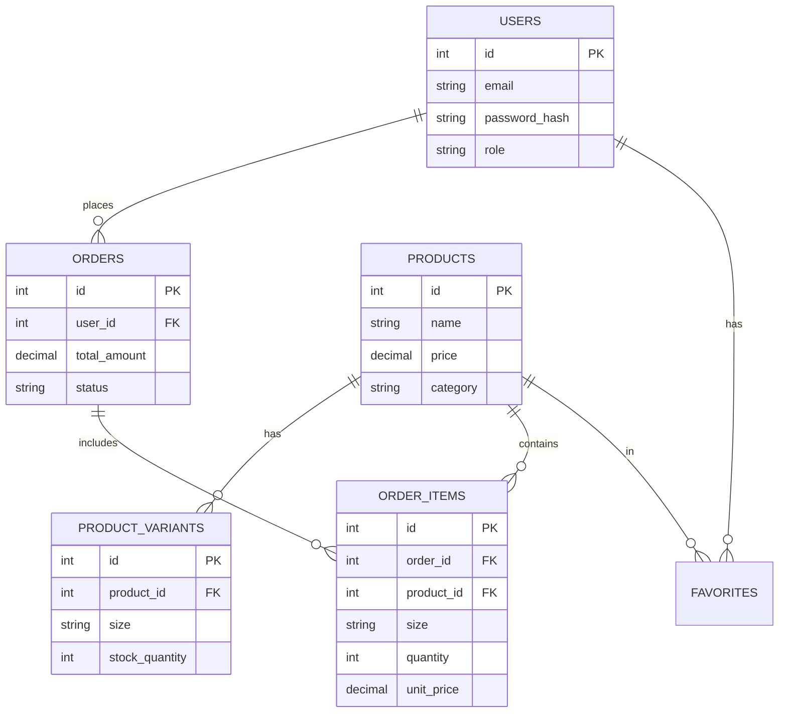

# DATABASE SCHEMA - MARKO

This document defines the PostgreSQL database structure for the MARKO project.

## Relationship Diagram (ERD)



---

## SQL Schema (PostgreSQL)

### 1. Users (`users`)
Management of client and administrator accounts.

```sql
CREATE TABLE users (
    id SERIAL PRIMARY KEY,
    email VARCHAR(255) UNIQUE NOT NULL,
    password_hash VARCHAR(255) NOT NULL,
    full_name VARCHAR(100),
    role VARCHAR(20) DEFAULT 'client' CHECK (role IN ('client', 'admin')),
    created_at TIMESTAMP DEFAULT CURRENT_TIMESTAMP
);
```

### 2. Products (`products`)
Main product catalog.

```sql
CREATE TABLE products (
    id SERIAL PRIMARY KEY,
    name VARCHAR(255) NOT NULL,
    description TEXT,
    price DECIMAL(10, 2) NOT NULL,
    category VARCHAR(50),  -- e.g., 'Women', 'Men', 'Accessories'
    image_url TEXT,
    is_active BOOLEAN DEFAULT TRUE,
    created_at TIMESTAMP DEFAULT CURRENT_TIMESTAMP
);
```

### 3. Stocks & Variants (`product_variants`)
Management of sizes and stocks per product. Allows having a "T-shirt" product with different sizes (S, M, L) and associated stocks.

```sql
CREATE TABLE product_variants (
    id SERIAL PRIMARY KEY,
    product_id INTEGER REFERENCES products(id) ON DELETE CASCADE,
    size VARCHAR(10) NOT NULL, -- e.g., 'S', 'M', '42', 'OneSize'
    stock_quantity INTEGER DEFAULT 0 CHECK (stock_quantity >= 0),
    UNIQUE(product_id, size) -- Prevents having size M twice for the same product
);
```

### 4. Orders (`orders`)
Purchase history.

```sql
CREATE TABLE orders (
    id SERIAL PRIMARY KEY,
    user_id INTEGER REFERENCES users(id) ON DELETE SET NULL,
    total_amount DECIMAL(10, 2) NOT NULL,
    status VARCHAR(50) DEFAULT 'pending', -- 'pending', 'paid', 'shipped', 'cancelled'
    shipping_address TEXT NOT NULL,
    stripe_payment_id VARCHAR(255),
    created_at TIMESTAMP DEFAULT CURRENT_TIMESTAMP
);
```

### 5. Order Lines (`order_items`)
Details of products contained in an order. We store the price at the time of purchase (`unit_price`) to freeze history even if the product price changes later.

```sql
CREATE TABLE order_items (
    id SERIAL PRIMARY KEY,
    order_id INTEGER REFERENCES orders(id) ON DELETE CASCADE,
    product_id INTEGER REFERENCES products(id) ON DELETE SET NULL,
    size VARCHAR(10) NOT NULL, -- Storing the chosen size
    quantity INTEGER NOT NULL CHECK (quantity > 0),
    unit_price DECIMAL(10, 2) NOT NULL -- Snapshot price at the time of order
);
```

### 6. Favorites (`favorites`)
User wishlist.

```sql
CREATE TABLE favorites (
    user_id INTEGER REFERENCES users(id) ON DELETE CASCADE,
    product_id INTEGER REFERENCES products(id) ON DELETE CASCADE,
    created_at TIMESTAMP DEFAULT CURRENT_TIMESTAMP,
    PRIMARY KEY (user_id, product_id) -- A user can only like a product once
);
```

---

## Implementation Notes

*   **Referential Integrity**: Foreign keys (`REFERENCES`) ensure that an order cannot be created for a non-existent user.
*   **Stocks**: Upon an order, `stock_quantity` must be decremented in the `product_variants` table.
*   **Security**: Passwords must be hashed (e.g., bcrypt) before insertion. Never store in plain text.


## DATABASE 

